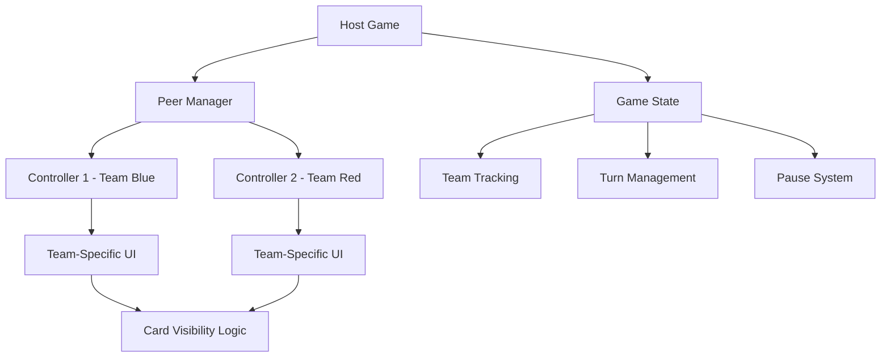

# Design Document: Controller Improvements

## Overview

This design addresses five key improvements to the Alias game's mobile controller system: removing the timer display from controllers, fixing pause functionality, implementing team-specific card visibility, adding pause controls to the host game, and enabling turn initiation from controllers. The solution focuses on enhancing the peer-to-peer communication system and refining the user interface logic to provide a more intuitive and functional remote gaming experience.

## Architecture

The improvements build upon the existing PeerJS-based architecture with the following key components:

- **Enhanced GameSyncState**: Extended to include team identification and connection tracking
- **Improved Controller Logic**: Team-aware rendering and enhanced action handling
- **Host Game Enhancements**: Added pause controls and improved state synchronization
- **Refined Peer Communication**: Better state broadcasting and action handling



## Components and Interfaces

### Enhanced GameSyncState Interface

```typescript
interface GameSyncState {
    currentCard: Card | null;
    currentWordIndex: number;
    timerActive: boolean;
    timeLeft: number;
    teamColor: 'blue' | 'red';
    teamName: string;
    isPaused: boolean;
    // New fields
    activeTeamColor: 'blue' | 'red';  // Which team's turn it is
    connectionCount: number;           // Number of connected controllers
    canStartTurn: boolean;            // Whether this controller can start turns
    gamePhase: 'playing' | 'turnActive' | 'turnEnd' | 'specialTurn' | 'winner';
}
```

### Enhanced GameAction Types

```typescript
type GameAction =
    | { type: 'CORRECT' }
    | { type: 'SKIP' }
    | { type: 'PAUSE' }
    | { type: 'RESUME' }
    | { type: 'START_TURN' };  // New action type
```

### Controller Connection Management

```typescript
interface ControllerConnection {
    id: string;
    teamColor: 'blue' | 'red';
    connection: DataConnection;
}
```

## Data Models

### Team Assignment Logic

Controllers will be assigned to teams based on connection order:
- First connection: Team Blue
- Second connection: Team Red
- Additional connections: Assigned to teams with fewer connections

### State Synchronization Model

The host maintains the authoritative game state and broadcasts updates to all controllers. Each controller receives the full state but renders only team-appropriate content based on:
- Current team turn
- Controller's assigned team
- Game phase
- Connection count

## Correctness Properties

*A property is a characteristic or behavior that should hold true across all valid executions of a system-essentially, a formal statement about what the system should do. Properties serve as the bridge between human-readable specifications and machine-verifiable correctness guarantees.*

### Property 1: Pause State Synchronization
*For any* pause or resume action triggered from either controller or host, the game state should transition correctly and all connected devices should reflect the new state immediately.
**Validates: Requirements 2.1, 2.2, 2.3, 2.4, 4.2, 4.4**

### Property 2: Team-Based Card Visibility
*For any* game state with two connected controllers, the word card should be visible only to the controller belonging to the currently active team.
**Validates: Requirements 3.1, 3.2, 3.3**

### Property 3: Single Controller Card Display
*For any* game state with only one connected controller, that controller should always display the word card during active turns regardless of team assignment.
**Validates: Requirements 3.4**

### Property 4: Turn Control Authority
*For any* controller, turn start controls should be displayed only when the controller belongs to the team whose turn is ready to start.
**Validates: Requirements 5.1, 5.4**

### Property 5: Turn Initiation State Changes
*For any* "Start Turn" action triggered from a controller, the game should transition to active turn state and the host should reflect this change immediately.
**Validates: Requirements 5.2, 5.3**

### Property 6: Active Turn UI Consistency
*For any* active turn state, only the controller belonging to the active team should display word cards and action buttons.
**Validates: Requirements 5.5**

## Error Handling

### Connection Loss Scenarios
- **Controller Disconnection**: Host maintains game state and continues operation
- **Host Disconnection**: Controllers display connection lost message
- **Partial Network Issues**: Implement retry logic with exponential backoff

### State Synchronization Failures
- **Message Loss**: Implement acknowledgment system for critical state changes
- **State Drift**: Periodic full state synchronization to prevent inconsistencies
- **Invalid Actions**: Validate actions on host before applying state changes

### Team Assignment Edge Cases
- **Rapid Connections**: Queue connection requests to prevent race conditions
- **Connection Drops During Assignment**: Reassign teams based on remaining connections
- **Invalid Team States**: Fallback to single-controller mode if team assignment fails

## Testing Strategy

### Unit Testing Approach
- **Component Isolation**: Test controller and host components independently
- **State Management**: Verify game state transitions and persistence
- **UI Rendering**: Test conditional rendering based on team and game state
- **Peer Communication**: Mock PeerJS connections for reliable testing

### Property-Based Testing Configuration
- **Testing Framework**: Use fast-check for TypeScript property-based testing
- **Test Iterations**: Minimum 100 iterations per property test
- **State Generation**: Generate random game states, team configurations, and connection scenarios
- **Action Sequences**: Test sequences of user actions (pause, resume, start turn, etc.)

### Integration Testing
- **End-to-End Flows**: Test complete user journeys from connection to game completion
- **Multi-Device Simulation**: Simulate multiple controllers connecting and interacting
- **Network Conditions**: Test under various network latency and reliability conditions
- **Browser Compatibility**: Verify functionality across different mobile browsers

### Test Data Generation
- **Game States**: Generate valid game states with various team positions and phases
- **Connection Scenarios**: Create different controller connection patterns
- **User Actions**: Generate sequences of valid and invalid user interactions
- **Network Events**: Simulate connection drops, reconnections, and message delays